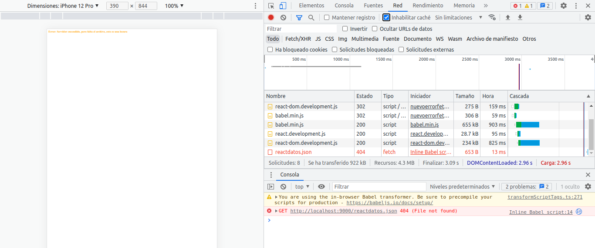
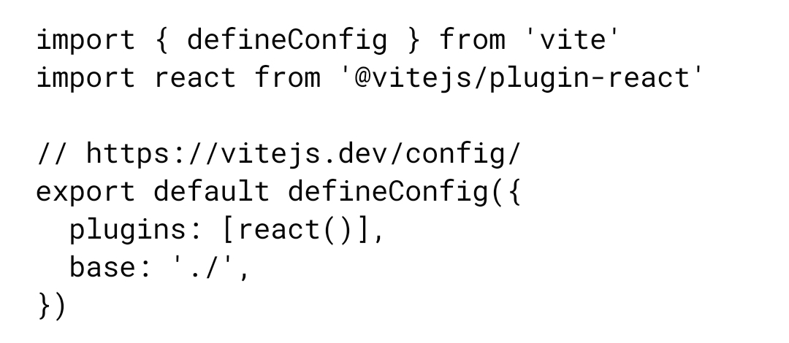

# Componentes-web
* Codigos que usare en raw

https://hector-espacio.github.io/Componentes-web/

* para servidor de consola usando python

cd direccioncarpeta/carpetaindex

python3 -m http.server 9000

* luego en el navegador

http://localhost:9000/ (si el archivo se llama index)

http://localhost:9000/nombre.html

---

* desactivar las cookies del navegador para que no se guarde en cache los archivos json, ya que si cambia el json o sse cambia de nombre al json local, el navegador seguira usando el json viejo y eso no queremos

---
PARA USAR LA MAQUINA VIRTUAL, TENER LOS CAMBIOS DE LA NUVE ALA MAQUINA VIRTUAL
git pull origin inicial

---
para hacer dist alos archivos vite
se debe poner asi el archivo vite.condig.js :

---
liegonde la configuracion contruir el dist en codespace, estabdo 

exactamebte en la carpeta del proyecto

